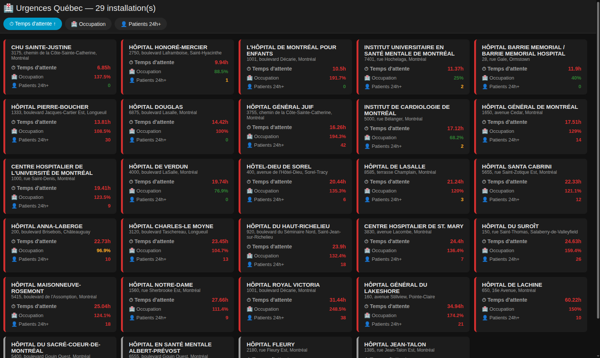
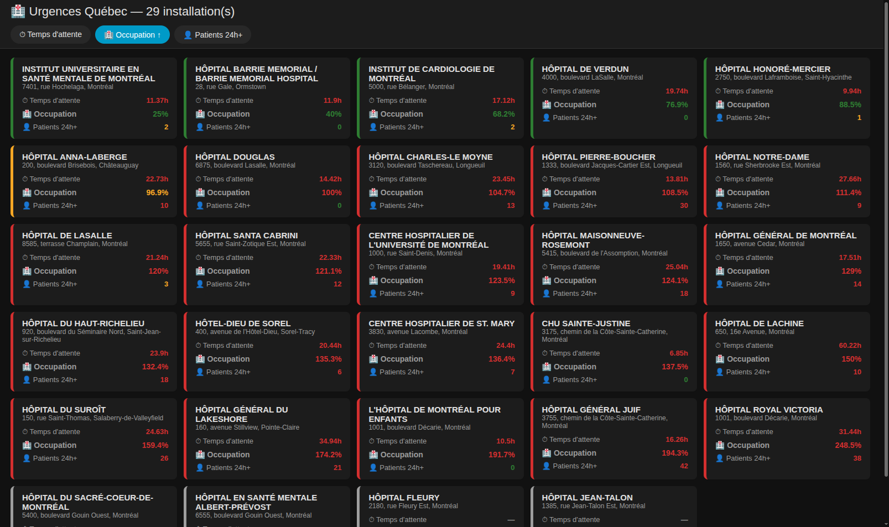
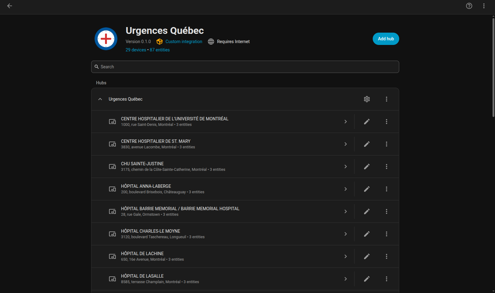
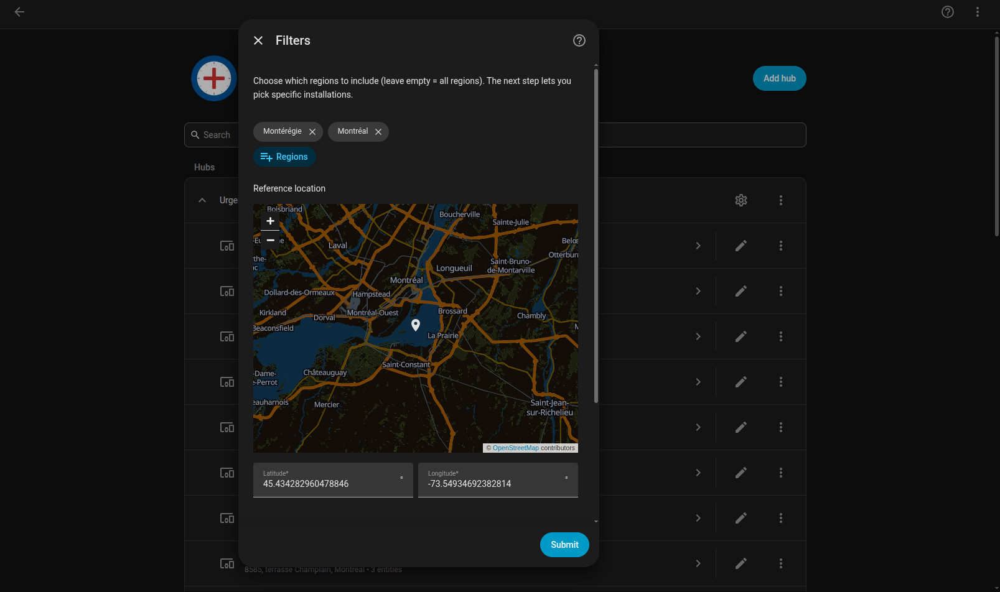
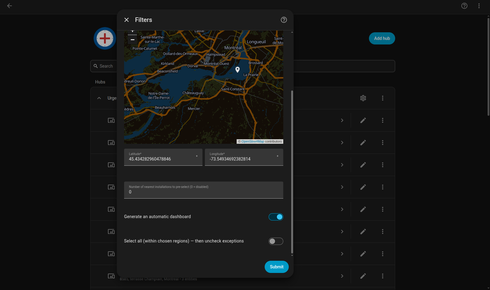

# Urgences Québec pour Home Assistant / Urgences Québec for Home Assistant

Intégration Home Assistant affichant le temps d'attente, le taux d'occupation et le nombre de patients sur civière depuis plus de 24h/48h pour les urgences du Québec — à partir des données ouvertes officielles du **MSSS** (ministère de la Santé et des Services sociaux). Aucune donnée scrapée : le fichier CSV horaire officiel est téléchargé directement.

A Home Assistant integration showing wait time, occupancy rate, and the number of patients on a stretcher for more than 24h/48h for Québec emergency rooms — sourced from **MSSS** (Québec's health ministry) official open data. No scraping: the official hourly CSV file is downloaded directly.

---

## 🇫🇷 Français

### Fonctionnalités

- **Source officielle** — [Fichier horaire des données de la situation à l'urgence](https://www.donneesquebec.ca/recherche/dataset/fichier-horaire-des-donnees-de-la-situation-a-l-urgence) (Données Québec / MSSS), licence CC-BY. 120 installations couvertes.
- **Sélection par région** — filtre multi-région (ex. Montérégie + Montréal en même temps), liste dérivée dynamiquement des vraies données, pas codée en dur.
- **Sélection par proximité** — position de référence (par défaut celle de ton serveur Home Assistant, déplaçable sur une carte), avec option "les N installations les plus proches" pré-cochées automatiquement — librement modifiables ensuite.
- **"Tout sélectionner"** — coche toutes les installations d'un coup (filtrées par région), puis décoche seulement les exceptions, au lieu de tout cocher une par une.
- **3 capteurs par installation** : temps d'attente (h), taux d'occupation (%), patients sur civière depuis 24h+. Adresse civique affichée sous le nom de l'appareil.
- **Bilingue natif** — l'interface de configuration et les noms de capteurs suivent automatiquement la langue de ton profil Home Assistant (FR/EN), sans réglage séparé.
- **Dashboard optionnel** — panneau dédié dans la barre latérale (activable/désactivable dans la config), pleine page, cartes triables par temps d'attente / occupation / nombre de patients (clic = croissant, reclic sur le même bouton = inverse), code couleur vert/jaune/rouge.

### Captures d'écran

**Panneau dashboard, trié par temps d'attente (clic = croissant)** — pleine page, aucune barre latérale nécessaire pour tout voir d'un coup :

**Même panneau, trié par occupation (reclic sur le même bouton = décroissant)** — code couleur vert/jaune/rouge selon des seuils par métrique, et exemple de valeurs manquantes (`—`) en bas de liste :

**Vue native Home Assistant** — chaque urgence est un appareil distinct avec son adresse civique, ses 3 capteurs, et l'icône dédiée de l'intégration :

**Configuration — sélection de région(s) et position de référence** — carte interactive, multi-région, position par défaut = celle de ton serveur HA (déplaçable) :

**Configuration — proximité et options** — nombre d'installations les plus proches à présélectionner, toggle dashboard, toggle "Tout sélectionner" :

### Installation

**Via HACS (dépôt personnalisé)**
1. Clique le badge ci-dessus, ou va dans **HACS → Intégrations → ⋮ → Dépôts personnalisés**
2. Ajoute `https://github.com/lyntoo/urgences-quebec-ha` comme **Integration**
3. Cherche **Urgences Québec** et installe
4. Redémarre Home Assistant

**Manuelle**
1. Copie le dossier `custom_components/urgences_quebec` dans `config/custom_components/`
2. Redémarre Home Assistant

### Configuration

1. **Paramètres → Appareils et services → Ajouter une intégration → Urgences Québec**
2. Ensuite, ouvre **Configurer** pour choisir : région(s), position de référence + nombre d'installations les plus proches (optionnel), et les installations précises à suivre (liste à cocher, avec "Tout sélectionner")
3. Modifiable en tout temps via **Configurer**, sans retirer l'intégration

### ⚠️ Valeurs manquantes ("—")

Certaines installations affichent `—` pour une ou plusieurs métriques. **Ce n'est pas un bug** — vérifié directement dans le fichier source du MSSS : plusieurs établissements (ex. un hôpital psychiatrique, ou certains centres qui ne rapportent pas cette donnée précise) ont littéralement `"pas d'information disponible"` à la source. L'intégration reflète fidèlement l'absence de donnée plutôt que d'inventer une valeur.

### Comment ça marche

- **Coordinateur** : télécharge le CSV horaire du MSSS (encodage ISO-8859-1, particularité du fichier source), calcule le temps d'attente / taux d'occupation / patients 24h+ par installation.
- **Géolocalisation** : coordonnées officielles obtenues par jonction avec le jeu de données [Fichiers cartographiques M02 des installations et établissements](https://www.donneesquebec.ca/recherche/dataset/fichiers-cartographiques-m02-des-installations-et-etablissements) (Données Québec) — pas de géocodage tiers, données 100% officielles.
- **Panneau dashboard** : JavaScript natif (aucune dépendance externe, aucune carte HACS requise), enregistré via l'API stable `panel_custom` de Home Assistant — pas de dépendance à une API privée qui pourrait casser à une mise à jour.

### Avertissement

Ce projet n'est pas affilié au MSSS ni à Santé Québec, et n'est pas affilié ou endossé par Home Assistant / Nabu Casa. Il utilise uniquement des données ouvertes publiques et les API publiques de Home Assistant. En cas d'urgence médicale réelle, appelle le 911 — ne te fie jamais uniquement à ces données pour une décision médicale.

---

## 🇬🇧 English

### Features

- **Official source** — [Hourly Emergency Room Situation File](https://www.donneesquebec.ca/recherche/dataset/fichier-horaire-des-donnees-de-la-situation-a-l-urgence) (Données Québec / MSSS), CC-BY licensed. 120 installations covered.
- **Region selection** — multi-region filter (e.g. Montérégie + Montréal at once), list built dynamically from real data, never hardcoded.
- **Proximity selection** — reference location (defaults to your Home Assistant server's location, movable on a map), with an optional "N nearest installations" auto pre-selection — freely editable afterwards.
- **"Select all"** — check every installation at once (region-filtered), then uncheck only the exceptions, instead of checking each one individually.
- **3 sensors per installation**: wait time (h), occupancy rate (%), patients on a stretcher for 24h+. Street address shown under the device name.
- **Native bilingual support** — the config UI and sensor names automatically follow your Home Assistant profile language (FR/EN), no separate setting needed.
- **Optional dashboard** — dedicated sidebar panel (toggle on/off in the config), full-page, cards sortable by wait time / occupancy / patient count (click = ascending, click the same button again = reverse), green/yellow/red color coding.

### Screenshots

**Dashboard panel, sorted by wait time (click = ascending)** — full page, no sidebar needed to see everything at once:

**Same panel, sorted by occupancy (click the same button again = descending)** — green/yellow/red color coding per metric threshold, and an example of missing values (`—`) at the bottom of the list:

**Native Home Assistant view** — each ER is its own device with its street address, 3 sensors, and the integration's dedicated icon:

**Configuration — region(s) and reference location** — interactive map, multi-region, default location = your HA server's (movable):

**Configuration — proximity and options** — number of nearest installations to pre-select, dashboard toggle, "Select all" toggle:

### Installation

**Via HACS (custom repository)**
1. Click the badge above, or go to **HACS → Integrations → ⋮ → Custom repositories**
2. Add `https://github.com/lyntoo/urgences-quebec-ha` as an **Integration**
3. Search for **Urgences Québec** and install
4. Restart Home Assistant

**Manual**
1. Copy the `custom_components/urgences_quebec` folder into `config/custom_components/`
2. Restart Home Assistant

### Setup

1. **Settings → Devices & services → Add Integration → Urgences Québec**
2. Then open **Configure** to choose: region(s), reference location + number of nearest installations (optional), and the exact installations to track (checklist, with "Select all")
3. Editable anytime via **Configure**, no need to remove the integration

### ⚠️ Missing values ("—")

Some installations show `—` for one or more metrics. **This is not a bug** — verified directly against the MSSS source file: several facilities (e.g. a psychiatric hospital, or certain centres that don't report this specific figure) literally have `"pas d'information disponible"` (no information available) at the source. The integration faithfully reflects the absence of data rather than inventing a value.

### How it works

- **Coordinator**: downloads the MSSS hourly CSV (ISO-8859-1 encoding, a quirk of the source file), computes wait time / occupancy rate / patients 24h+ per installation.
- **Geolocation**: official coordinates obtained by joining with the [M02 Cartographic Files of Installations and Establishments](https://www.donneesquebec.ca/recherche/dataset/fichiers-cartographiques-m02-des-installations-et-etablissements) dataset (Données Québec) — no third-party geocoding, 100% official data.
- **Dashboard panel**: vanilla JavaScript (no external dependency, no HACS card required), registered via Home Assistant's stable `panel_custom` API — no dependency on a private API that could break on an update.

### Disclaimer

This project is not affiliated with MSSS or Santé Québec, and is not affiliated with or endorsed by Home Assistant / Nabu Casa. It only uses public open data and Home Assistant's public APIs. In a real medical emergency, call 911 — never rely solely on this data for a medical decision.
